# VI - Skripting

<br><br>


<!-- ---

# 📋
### Agenda

- Wieso VI-Skripting?
- Was ist VI-Skriping?
- Wie geht VI-Skripting?
- Praxisbeispiel
   -->
---

# Wieso VI-Skripting?

--

## 🤖 Automatisierung

#### FPGA Testpanel
Test von Prüfadapter Verdrahtung
<br>
Testpanel für 96 FPGA IO's

--

## 😬
## Fehler vermeiden

--

## 🔄 
## Iterative Entwicklung fördern
---

### Was ist VI-Skripting?

--

#### Generierung von LabVIEW Code

--

mit LabVIEW!

---

### Wie geht VI-Skripting?

--

⚡ VI - Scripting aktivieren

--

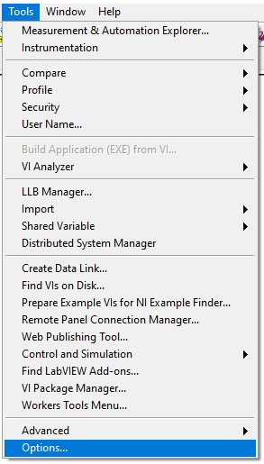

--

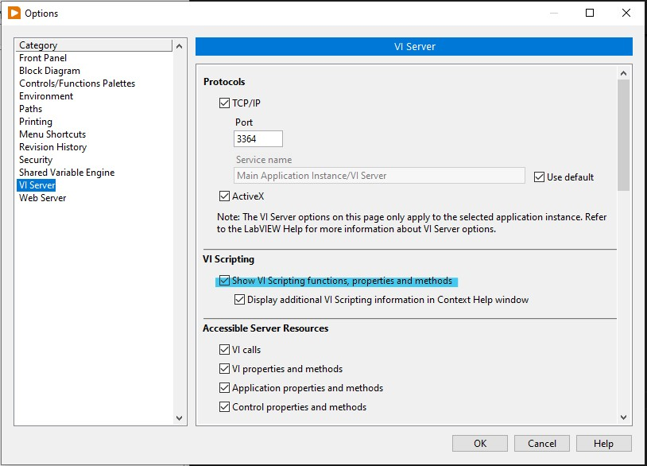

--

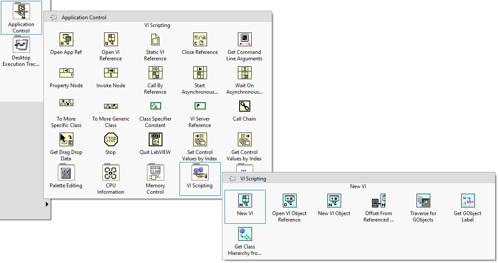

---

### Beispiel
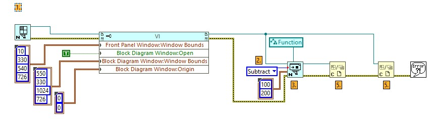

Resultat?

--

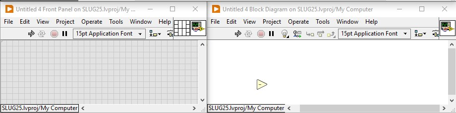

--


<br>
Mehr zu VI-Scripting

https://www.ni.com/docs/en-US/bundle/labview/page/vi-scripting_2.html

---

## Praxis: Messhardware
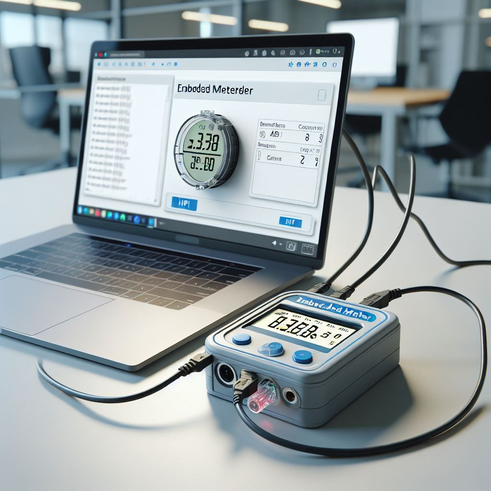

--

## Spezifikation Hardware
- Embedded Linux 🐧
- .NET Framework
- Anzahl Kanäle: 16 <br>
- Rate: 1 MS/s (16 Bit) 🔥
- HTTP Interface 🌐

--

## Interaktion

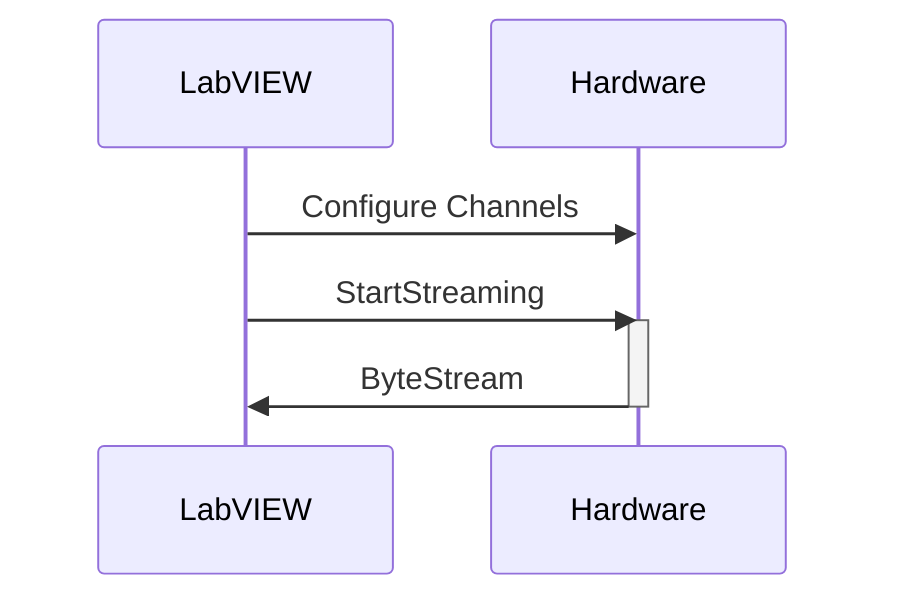
```mermaid
sequenceDiagram
    participant LabVIEW
    participant Hardware
    LabVIEW->>Hardware: Configure Channels
    LabVIEW->>Hardware: StartStreaming
    activate Hardware
    Hardware->>LabVIEW: ByteStream
    deactivate Hardware

```


---

## HTTP
HTTP (Hypertext Transfer Protocol)

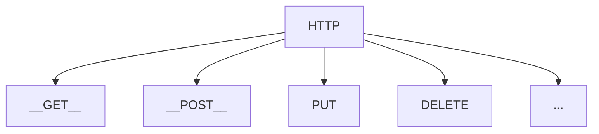
```mermaid
flowchart TD
  HTTP --> __GET__
  HTTP --> __POST__
  HTTP --> PUT
  HTTP --> DELETE
  HTTP --> ...
```
https://www.w3schools.com/tags/ref_httpmethods.asp

--

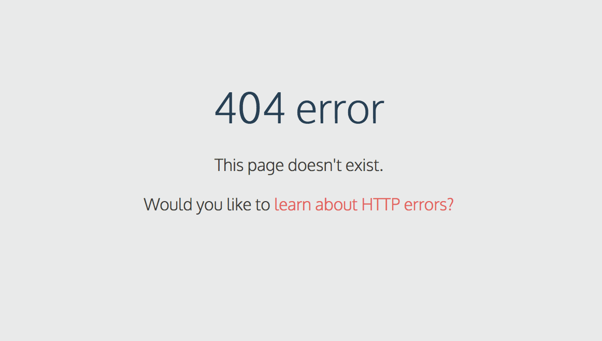


--

## HTTP in LABVIEW
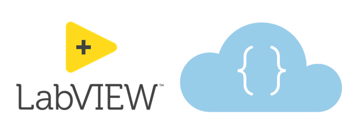

--

## Wo?
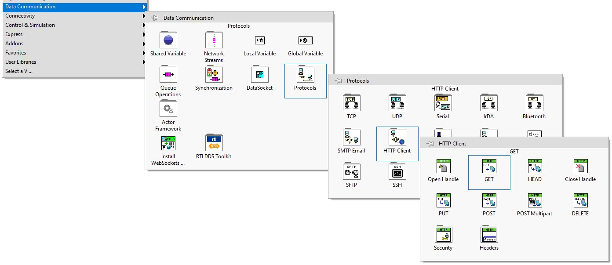

--

## Wie?
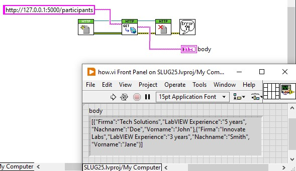

TypeDefs, Casting, sauberer Aufbau, OOP

---

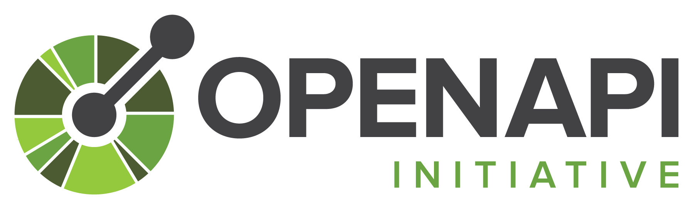<br>
*OpenAPI ist eine Spezifikation zum Erstellen von APIs, die Entwicklern ermöglicht, die Struktur ihrer APIs in einem standardisierten Format zu definieren.*
<br>
https://www.openapis.org/

--

### Beispiel Spezifikation
GET Abfrage über Teilnehmer am SLUG25
```json
{
  "openapi": "3.0.0",
  "info": {
    "title": "SLUG25 API",
    "version": "1.0.0"
  },
  "paths": {
    "/participants": {
      "get": {
        "summary": "Wer ist alles am SLUG25?",
        "responses": {
          "200": {
            "description": "Eine Liste der Teilnehmer",
            "content": {
              "application/json": {
                "schema": {
                  "$ref": "#/components/schemas/Person"
                }
              }
            }
          }
        }
      }
    }
  },
  "components": {
    "schemas": {
      "Person": {
        "type": "object",
        "properties": {
          "Vorname": {
            "type": "string"
          },
          "Nachname": {
            "type": "string"
          },
          "Firma": {
            "type": "string"
          },
          "LabVIEW Experience": {
            "type": "string"
          }
        }
      }
    }
  }
}

```

--

### Swagger Editor
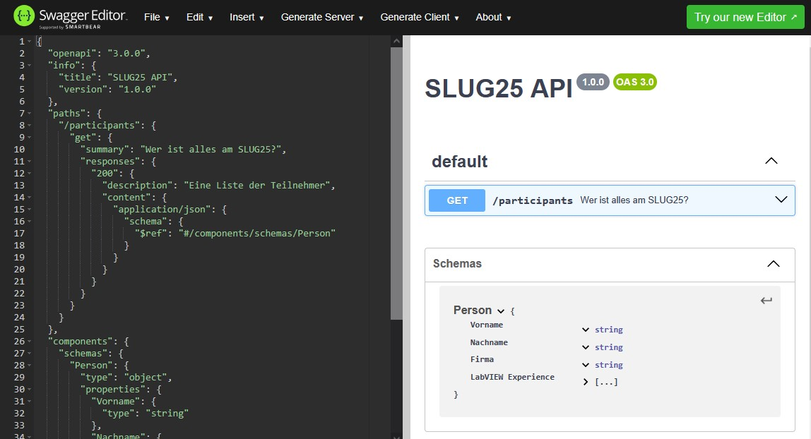

192.168.33.13:5000/swagger

--

### Code Generation
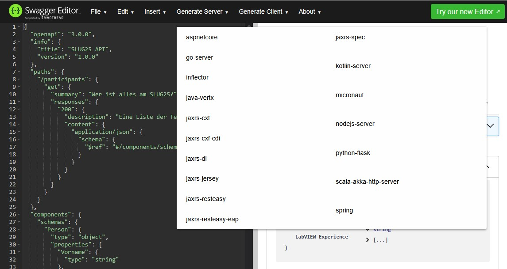

LabVIEW? 😩

--

## Moving Target
<br>


---

### Zielarchitektur

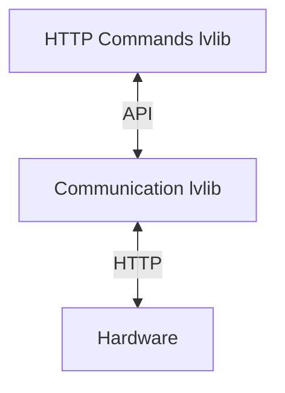
```mermaid
flowchart TD
    A[HTTP Commands lvlib] <-->|API| B[Communication lvlib]
    B <-->|HTTP| C[Hardware]
```

--

## Communication
HTTP Interaction
<br>


--

## HTTP Commands
- Library mit allen Commands
- OOP
- Factory Class

---

## Command Generator

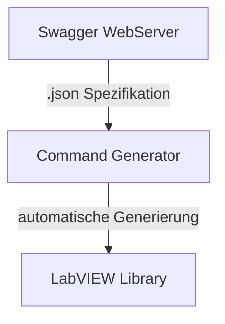
```mermaid
flowchart TD
    A[Swagger WebServer] -->|.json Spezifikation| B[Command Generator]
    B -->|automatische Generierung| C[LabVIEW Library]
```

--

## Wunschaufruf

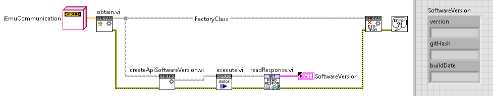

- Einfügen über QuickDrop (Path Name)
- Korrekte typeDef's für *obtain* und *read Response*

--

### 📄 VI-Dokumenation 
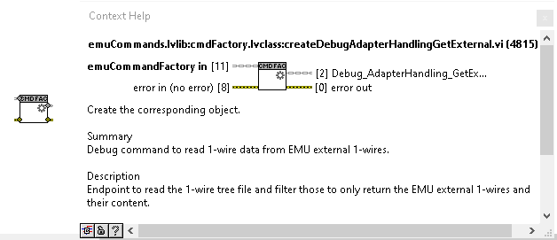
<br>
Von swagger.json übernommen

---

### 🚀 Starten wir!
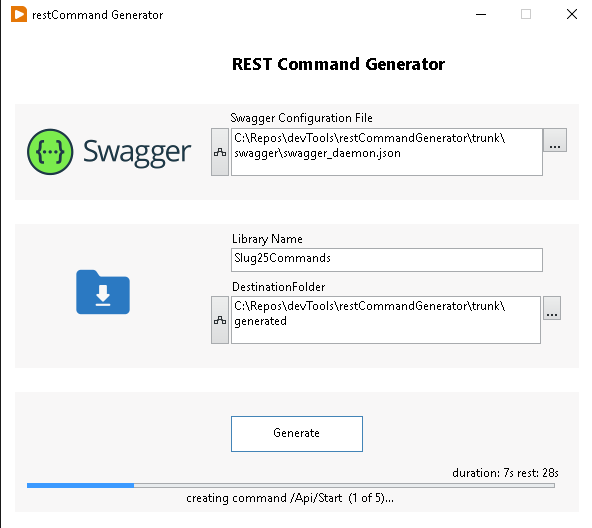

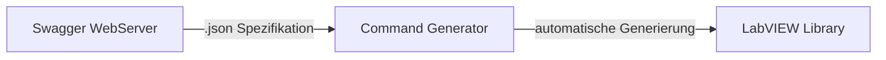
```mermaid
flowchart LR
    A[Swagger WebServer] -->|.json Spezifikation| B[Command Generator]
    B -->|automatische Generierung| C[LabVIEW Library]
```

--

### Blockdiagramm
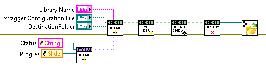

---

## TypeDefs erzeugen
von

```json
"MotorState": {
        "type": "object",
        "properties": {
          "version": {
            "type": "string",
            "nullable": true
          },
          "actualMode": {
            "$ref": "#/components/schemas/McRunMode"
          },
          "controlRegister": {
            "type": "array",
            "items": {
              "$ref": "#/components/schemas/McControlRegister"
            },
            "nullable": true
          },
          "firmwareStates": {
            "$ref": "#/components/schemas/McFirmwareStates"
          }
        },
        "additionalProperties": false
      },
"McRunMode": {
        "enum": [
          "Config",
          "Manual",
          "EcIe",
          "DC",
          "EcHs",
          "EcSl",
          "Error"
        ],
        "type": "string"
      },
"McControlRegister": {
        "enum": [
          "None",
          "MotorEnabled",
          "DirectionCcw",
          "DirectionCw",
          "ChangingWorkingPoint",
          "MotorBrake",
          "Busy",
          "Error"
        ],
        "type": "string"
      },
"McFirmwareStates": {
        "enum": [
          "Booted",
          "NotConfigured",
          "ManualDisable",
          "ManualEnable",
          "EcIeDisable",
          "EcIeEnable",
          "EcIeChangeWorkingPoint",
          "DcDisable",
          "DcRunning",
          "DcDischargePs",
          "DcBraked",
          "DcChangeWorkingPoint",
          "EcHsDisabled",
          "EcHsDischargePs",
          "EcHsRunning",
          "EcHsBraked",
          "EcHsSync",
          "EcHsChangeWorkingPoint",
          "EcSlDisabled",
          "EcSlStartup",
          "EcSlRunning",
          "EcSlBraked",
          "EcSlSync",
          "EcSlChangeWorkingPoint",
          "EcSlDischargePs",
          "ErrorThermalShutdwon",
          "ErrorOverCurrent",
          "ErrorInvalidHall",
          "ErrorInvalidBemf",
          "ErrorHallTimeout",
          "ErrorBemfTimeout",
          "ErrorSensorless"
        ],
        "type": "string"
      }
```

zu

--


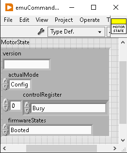

--

### TypeDefs Code 1/3

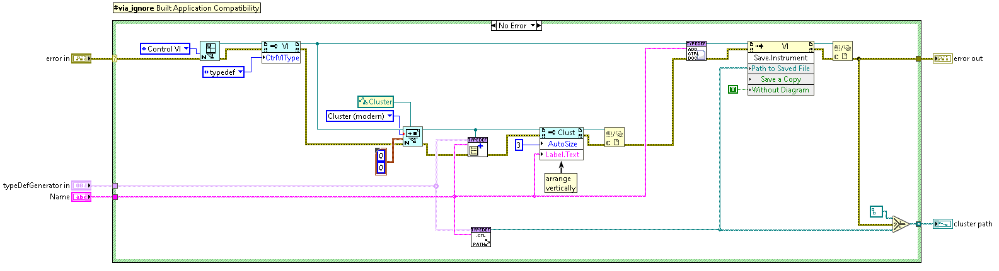

--

### TypeDefs Code 2/3

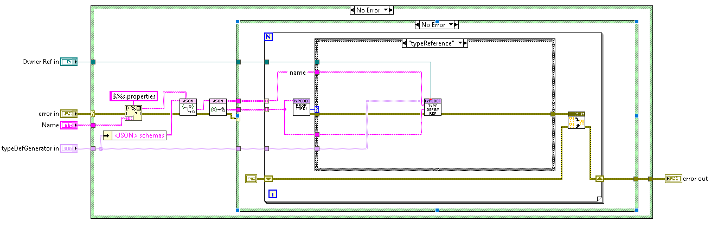

--

### TypeDefs Code 3/3

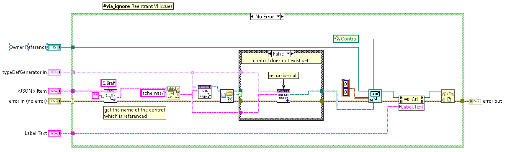


---

## Kommando-Typen
Erzeugen des richtigen CMD Types mit passendem Template.

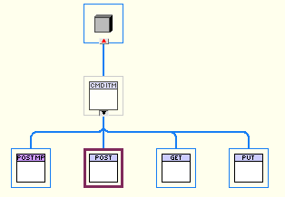

---

### Anpassen der Controls/Indicators
Ersetzen von Request und Response Datentypen

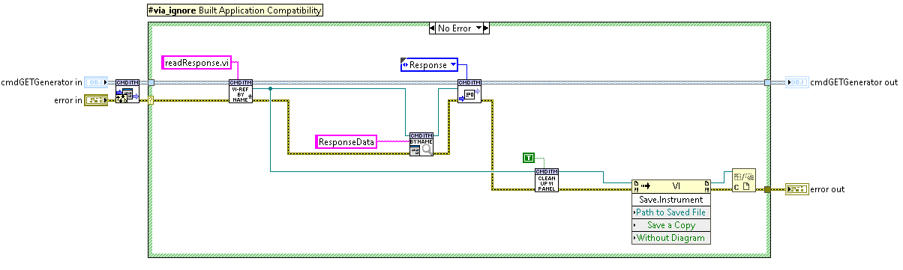

--

## Payload ersetzen
Ersetzen eines Clusters

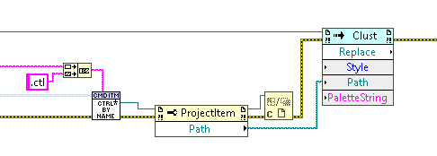

---

## Hinzufügen der Kommentare
Die Kommentare "Description" sowie "Summary" sollen im VI ersichtlich sein.

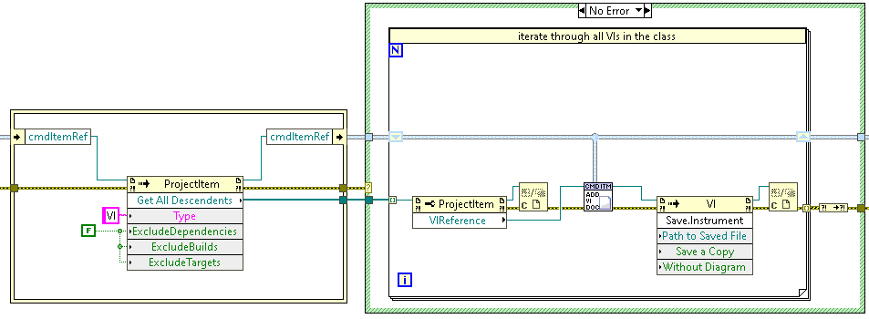

---

## Alle Schritte

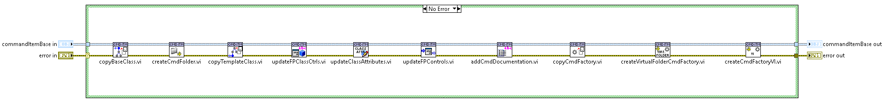

---

## Ergebnis

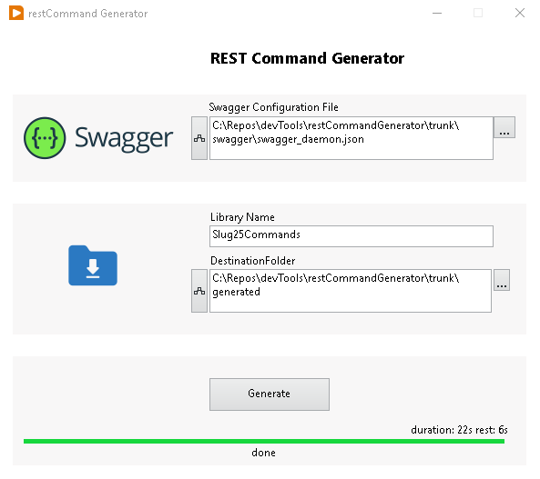

--

## Ergebnis

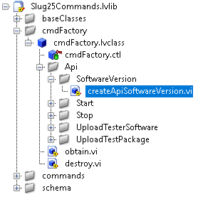
<br>
⏳ Dauer für 100 Kommandos: 7min
<br>
🧪VI - Analyzer "proofed"
<br>
♻ CI/CD mit Jenkins

---

## 📕Packed Lib in Package

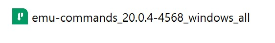
- Spezifikation in Library Dokumentation
- Libraries sind .xml Files
- Diff wird "schön"

--

### Lib Doc
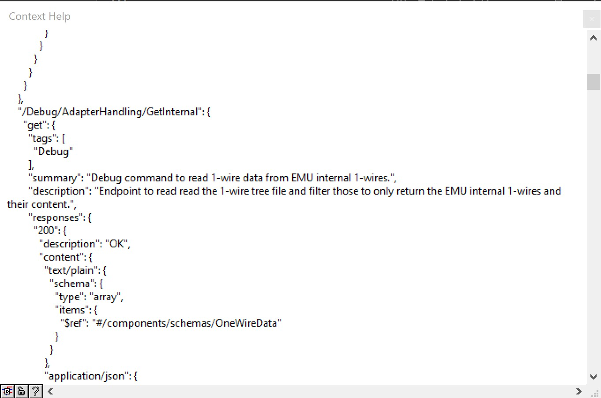

---

### Fazit

---


<br>
<br>
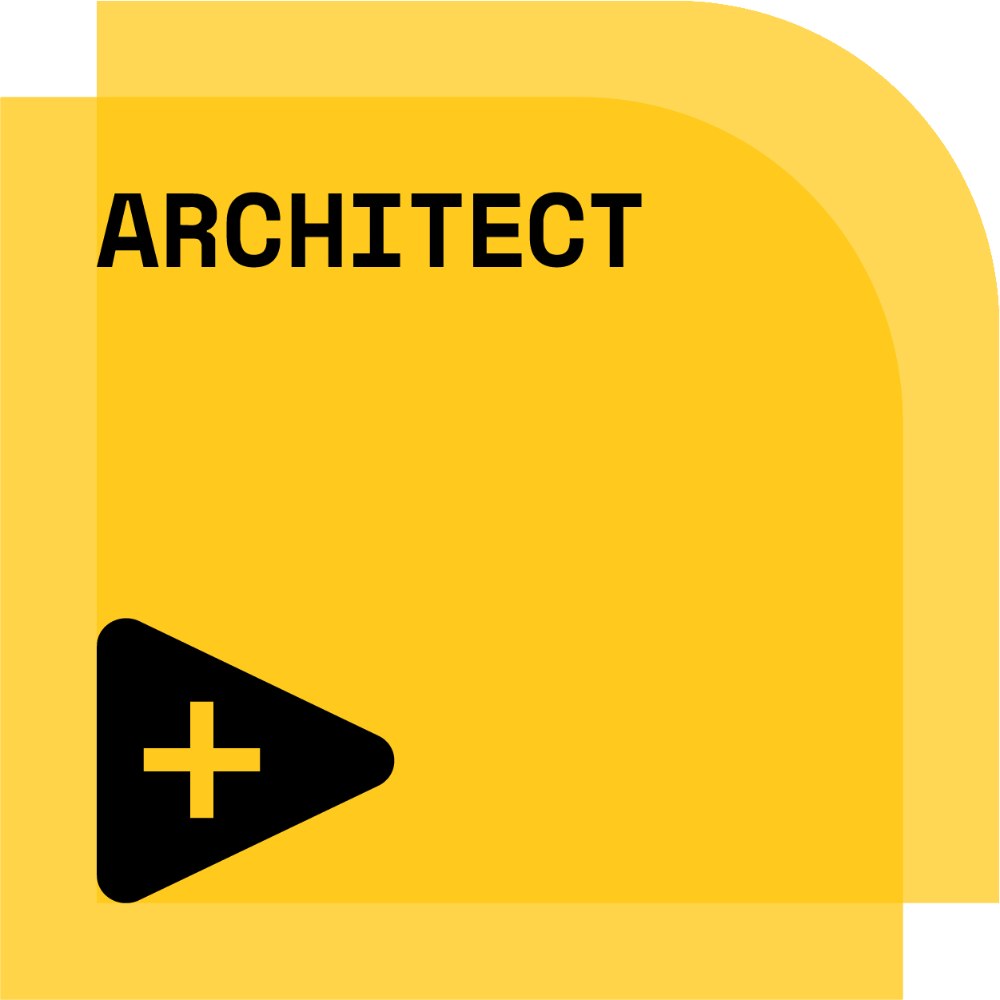

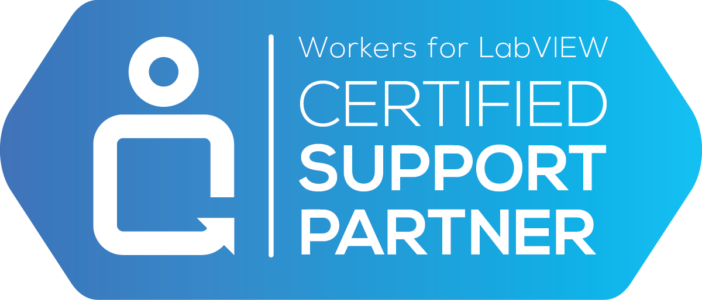

---

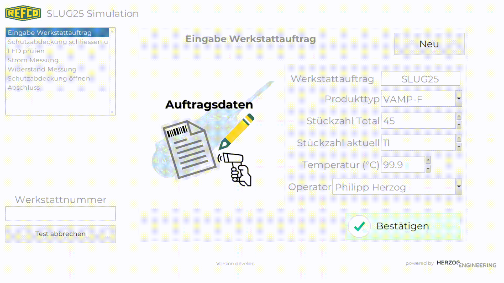